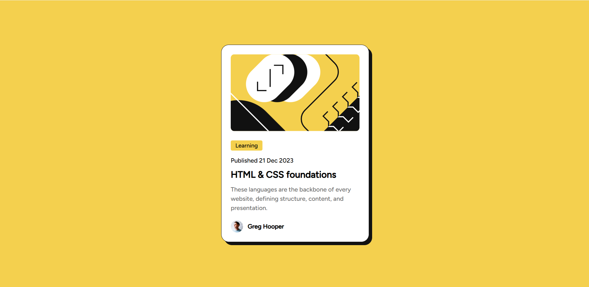

# Frontend Mentor - Blog Preview Card Solution

This is a solution to the [Blog Preview Card Challenge on Frontend Mentor](https://www.frontendmentor.io/challenges/blog-preview-card-ckPaj01IcS). Frontend Mentor challenges help you improve your coding skills by building realistic projects.

## Table of Contents

- [Overview](#overview)
  - [The Challenge](#the-challenge)
  - [Screenshot](#screenshot)
  - [Links](#links)
- [My Process](#my-process)
  - [Built With](#built-with)
  - [What I Learned](#what-i-learned)
  - [Continued Development](#continued-development)
  - [Useful Resources](#useful-resources)
- [Author](#author)

## Overview

### The Challenge

Users should be able to:

- View the optimal layout for the component depending on their device's screen size
- See hover and focus states for all interactive elements on the page

### Screenshot



### Links

- Solution URL: [Add your solution URL here](https://www.frontendmentor.io/solutions)
- Live Site URL: [Add your live site URL here](https://your-live-site-url.com)

## My Process

### Built With

- Semantic HTML5 markup
- CSS custom properties
- Flexbox
- Mobile-first workflow

### What I Learned

While working on this project, I learned how to:

- Use **CSS custom properties** for consistent theming.
- Implement **responsive design** using media queries.
- Create hover effects for interactive elements.

Here’s an example of a hover effect I implemented:

```css
h2:hover {
  color: var(--Yellow);
  transition: all 0.3s ease-in-out;
  cursor: pointer;
}
```

### Continued Development

Use this section to outline areas that you want to continue focusing on in future projects. These could be concepts you're still not completely comfortable with or techniques you found useful that you want to refine and perfect.

**Note: Delete this note and the content within this section and replace with your own plans for continued development.**

### Useful Resources

- [CSS Tricks](https://css-tricks.com/snippets/css/a-guide-to-flexbox/) - A Complete Guide to Flexbox - This helped me understand Flexbox better and apply it effectively in this project.
- [MDN Web Docs](https://developer.mozilla.org/en-US/docs/Web/CSS/Media_Queries) - Media Queries - This article was helpful for learning how to make my design responsive.

**Note: Delete this note and replace the list above with resources that helped you during the challenge. These could come in handy for anyone viewing your solution or for yourself when you look back on this project in the future.**

## Author

- Frontend Mentor - [@Shashank23codes](https://www.frontendmentor.io/profile/Shashank23codes)
- Linkdin - [Shashank Gupta](https://www.linkedin.com/in/shashank-gupta-238a96209)

**Note: Delete this note and add/remove/edit lines above based on what links you'd like to share.**

## Acknowledgments

This is where you can give a hat tip to anyone who helped you out on this project. Perhaps you worked in a team or got some inspiration from someone else's solution. This is the perfect place to give them some credit.

**Note: Delete this note and edit this section's content as necessary. If you completed this challenge by yourself, feel free to delete this section entirely.**
